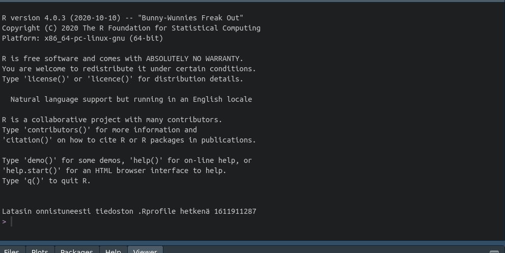

```{r setup, include=FALSE}
knitr::opts_chunk$set(echo = TRUE, 
                      message = FALSE, 
                      warning = FALSE, 
                      cache = FALSE,
                      fig.width=12,
                      fig.height=10,
                      dpi = 60, 
                      class.output = "img-fluid",
                      out.width=900)

# Oletusteema
library(ggplot2)
theme_set(
  theme_minimal(base_family = "PT Sans", base_size = 12) +
  theme(panel.grid = element_blank(),
        strip.background = element_rect(fill = "#fffff0", color = alpha("black", 1/8)),
        plot.title = element_text(family = "Pt Sans Caption"), 
        panel.background = element_rect(fill = "#fffff0", color = "#fffff0"),
        plot.background = element_rect(fill = "#fffff0", color = "#fffff0"),
        panel.border = element_rect(color = alpha("black", 1/12), fill = NA))
)
options(scipen = 999)
```

Kuulen usein vaikeuksista esittää Tilastokeskuksen [PxWeb](https://pxnet2.stat.fi/PXWeb/pxweb/fi/)-rajapinnan kautta jaettavia tilastoaineistoja kartalla. [ropengov](https://ropengov.github.io/)-projektissa on kehitetty R-kielen työkaluja sekä [pxweb](https://cran.r-project.org/web/packages/pxweb/index.html)-rajapinnan hyödyntämiseen että Tilastokeskuksen [paikkatietorajapinnan](https://www.stat.fi/org/avoindata/paikkatietoaineistot.html) hyödyntämiseen ([geofi](https://ropengov.github.io/geofi/)).

Tässä esimerkissä näytetään miten teet karttoja R-ohjelmalla PxWeb-rajapinnan datoista sekä kunta- että postinumeroaluepohjaisten aluejakojen mukaisesti. 

## Väkiluku kuntatasolla vuoden 2020 aluejaolla

Tässä esimerkissä haemme viimeisimmän kuntatason tiedon *väkiluvusta* vuoden 2020 aluejaolla. Tieto löytyy [kuntien avainluvut](https://pxnet2.stat.fi/PXWeb/pxweb/fi/Kuntien_avainluvut/Kuntien_avainluvut__2020/kuntien_avainluvut_2020_viimeisin.px/) osiosta.

Alla olevassa giffistä saat käsityksen mitä prosessi edellyttää:




Aluksi siis ladataan paketit sekä datojen hakemiseen, käsittelyyn että visualisointiin.


```{r libraries}
# datat
library(pxweb) # Tilastokeskuksen pxweb-rajapinta
library(geofi) # Tilastokeskuksen wfs-rajapinta
# käsittely & siivoaminen
library(dplyr) 
library(tidyr)
library(janitor)
# visualisointi
library(ggplot2)
```

Sitten haetaan taajama-aste -data pxweb-rajapinnasta ja kuntajat wfs-rajapinnasta, ja liitetään data yhteen.

```{r municipalities_with_data}
# WFS-data
muni20 <- get_municipalities(year = 2020)

# PXWEB-data
pxweb_query_list <- 
  list("Alue 2020"=c("*"),
       "Tiedot"=c("M411"))

# Download data 
px_data <- 
  pxweb_get(url = "http://pxnet2.stat.fi/PXWeb/api/v1/fi/Kuntien_avainluvut/2020/kuntien_avainluvut_2020_viimeisin.px",
            query = pxweb_query_list)

# Convert to data.frame 
px_data <- as_tibble(as.data.frame(px_data, column.name.type = "text", variable.value.type = "text"))

map <- left_join(muni20,
                 clean_names(px_data), by = c("name_fi" = "alue_2020"))
```

Sitten tehdään kartta, jossa täyttövärinä käytetään muuttujaa kuntien_avainluvut, joka siis yhtä kuin *Väkiluku, 2019*.

```{r plot1, fig.height = 9, fig.width = 6}
ggplot(map, aes(fill = kuntien_avainluvut)) + geom_sf()
```

### Väkiluku maakuntatasolla

`geofi'-paketin kuntaluokitusavaimen avulla voi aggregoida datan kuntatasolta ylöspäin [Tilastokeskuksen luokittelurajapinnan](https://data.stat.fi/api/classifications/v2/#/classifications) tietojen avulla. Seuraavassa koodikimpaleessa väkiluku aggregoidaan maakuntatasolle.


```{r maakuntakartta, fig.height = 9, fig.width = 6}
mk_map <- map %>% 
  group_by(maakunta_name_fi) %>% 
  summarise(kuntien_avainluvut = sum(kuntien_avainluvut))

ggplot(mk_map) + 
  geom_sf(aes(fill = kuntien_avainluvut)) +
  geom_sf_text(aes(label = paste(maakunta_name_fi, "\n",kuntien_avainluvut)), 
               size = 3, 
               color = "white")
```

## Väkiluku postinumeroalueittain

Postinumeroaluetasolla prosessi on pitkälti sama. Ensin haetaan datat ja yhdistellään 

```{r zipcode_map, fig.height = 9, fig.width = 6}
zipcodes <- get_zipcodes(year = 2020) 

pxweb_query_list <- 
  list("Postinumeroalue"=c("*"),
                           "Tiedot"=c("he_vakiy"))

px_data <- 
 pxweb_get(url = "http://pxnet2.stat.fi/PXWeb/api/v1/fi/Postinumeroalueittainen_avoin_tieto/2020/paavo_pxt_12ey.px",
           query = pxweb_query_list)
paavo <- as_tibble(as.data.frame(px_data, 
                                       column.name.type = "text", 
                                       variable.value.type = "text")) %>% 
  clean_names() %>% 
  mutate(postinumeroalue = sub(" .+$", "", postinumeroalue))


map <- left_join(zipcodes, paavo, by = c("posti_alue" = "postinumeroalue"))
ggplot(map) + 
  geom_sf(aes(fill = asukkaat_yhteensa_2018_he), color = alpha("white", 1/3))
```


